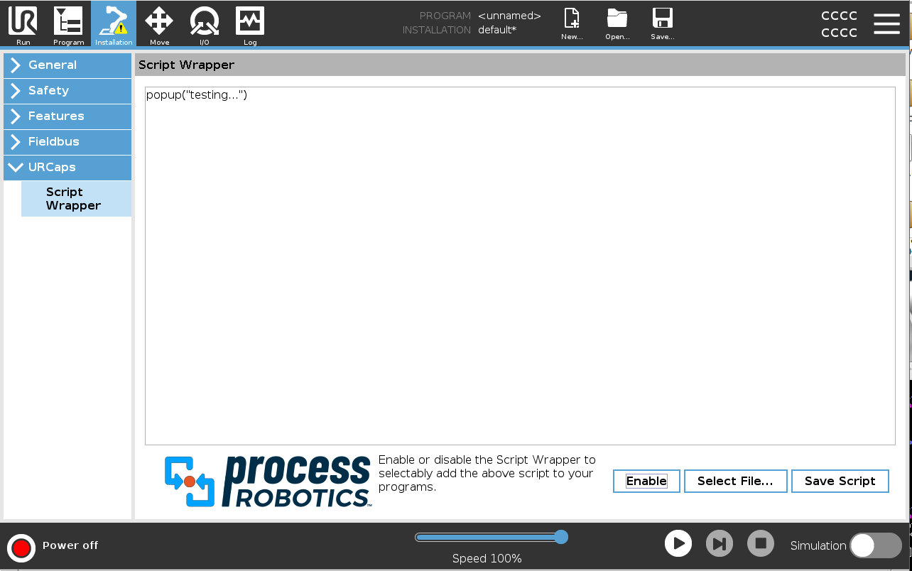

# ScriptWrapper

A simple URCap for contributing a common script to all programs saved with the associated Installation file.

Written with the assistance of chatGPT, but in no way did chatGPT do this on its own. It required lots of hand-holding and corrections which were responded to by "You are correct..." (you know the drill...)

A large, scroll-able, text area is provided for script file review and editing. 

Enable/Disable button controls whether or not the displayed script is contributed. 

### NOTE: No GUI keyboard is provided. Use a USB keyboard if needed.
